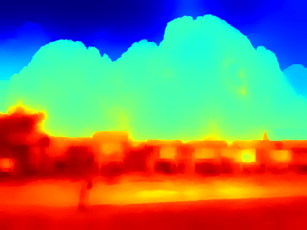
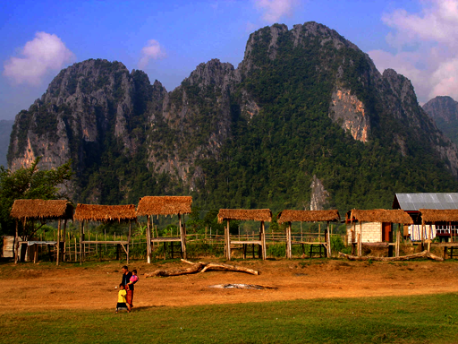

# Image Dehazing via Joint Estimation of Transmittance Map and Environmental Illumination

| Input  | Transmittance Map | Dehazed Image |
| ------------- | ------------- | ------------- |
|   |  |   

Haze limits the visibility of outdoor images, due to the existence of fog, smoke and dust in the atmosphere. In this work, we present an end to end system, which takes a hazy image as its input and returns a dehazed image. The proposed method learns the mapping between a hazy image and its corresponding transmittance map and the environmental illumination, by using a multi-scale Convolutional Neural Network. This repository contains a python implementation of the same.

- Authors: [Sanchayan Santra](http://san-santra.github.io/),[Ranjan Mondal](https://www.isical.ac.in/~ranjan15_r/),[Pranoy Panda](http://pranoy-panda.github.io/), Nishant Mohanty, Shubham Bhuyan
- Paper : [https://arxiv.org/abs/1812.01273](https://arxiv.org/pdf/1812.01273.pdf)

## Requirements:
1. Python 2.7+ or 3.5+.
2. [Tensorflow](https://www.tensorflow.org/) and its requirements. 
3. [NumPy](http://www.numpy.org/). The pip should work.
4. [scikit-image](http://scikit-image.org/docs/dev/api/skimage.html).
5. [Keras](https://keras.io/)
6. [Scipy](https://www.scipy.org/)
7. [Matplolib](https://matplotlib.org/)

## Folders and Files:
### Most important for using the proposed dehazing network in a new project:
1. [Final_code.py](src/final_assembly/Final_code.py)
2. [network.py](src/cnn_network/network.py)
3. [weights.h5](model/weights.h5)
### Most important for (re)training the proposed dehazing network on new data:
1. [preprocess.py](src/data_generation/preprocess.py)
2. [helper_functions.py](src/data_generation/helper_functions.py)

## Running the program
```bash
$ python src/final_assembly/Final_code.py [path/to/hazzy_image]
```
For example, running on the mountain image
```bash
$ python src/final_assembly/Final_code.py results/mountain_input.png
```

## License and Citation

This program is released under the LGPL.

Please cite our paper in your publications if it helps your research:
```
@article{santra2018image,
  title={Image Dehazing via Joint Estimation of Transmittance Map and Environmental Illumination},
  author={Santra, Sanchayan and Mondal, Ranjan and Panda, Pranoy and Mohanty, Nishant and Bhuyan, Shubham},
  journal={arXiv preprint arXiv:1812.01273},
  year={2018}
}
```

